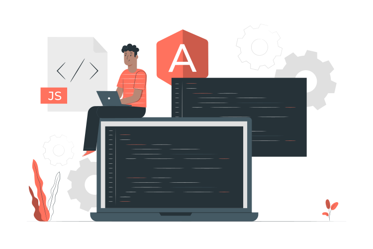

<h1 align="center">
    Привет , Я Иннокентий Белобородов!
</h1>

    
     &nbsp;
    
     &nbsp;

  

Я разносторонний человек и легки приспосабливаюсь к разным задачам (Full-Stack веб-разработчика 🌐, разработка приложений 📱 или дизайн начального уровня 🎨) в зависимости от того, что требуется для проекта. Я люблю изучать новые технологии 💻 и применять их для крутых проектов 🛠️.

### 🧐 Больше обо мне:

- 🔭 &nbsp; В активном поиске работы;
- 💼 &nbsp; Есть работа для меня? Напиши мне на [email](it38kent@gmail.com) или [telegram](https://t.me/Kennix88);
- 💬 &nbsp; Спрашивайте меня о чем угодно, я с радостью вам отвечу;
- 🌱 &nbsp; Я активно изучаю Typescript;
- 👨🏻‍💻 &nbsp; Большинство моих проектов доступны на [Github](https://github.com/kennix88?tab=repositories);
- 📫 &nbsp; Подпишись на меня в [Telegram](https://t.me/Kennix88_TG) и [Instagram](https://www.instagram.com/kennix88);
- 📝 &nbsp; Смотри мое [резюме](https://hh.ru/resume/9b70c720ff065569260039ed1f34646b374953) на hh.ru

### 🔨 Мои языки и инструменты:

 &nbsp;
 &nbsp;
 &nbsp;
 &nbsp;
 &nbsp;
 &nbsp;
 &nbsp;
 &nbsp;
 &nbsp;
 &nbsp;
 &nbsp;
 &nbsp;
 &nbsp;

 

<h3 align="center"> 📊 Статистика Github: </h3>

<h3 align="center"> 💵 Спонсорство: </h3>

Если вы захотите поддержать меня, я буду очень этому рад 🥺👉👈 

`Криптовалюта:` 
`BTC`:`bc1qtslwdxf7zj9unq0vx04gyfksknhtyxp2rwgh3z` 
`ETH`:`0x4cc2509C083968646989F1E80c25bDC047ea529B` 
`DOGE`:`DFW5smJE9reQxgbD2V7uXp6gUiE8BAd7xZ` 
`LTC`:`ltc1qrmjkyskjqgj9k7qqjgyev9rqkwp3qy9nlfatxx` 

`yooMoney`:`410018310209693` или [страница оплаты](https://yoomoney.ru/to/410018310209693)  
`QIWI`:`+79246069228` или [страница оплаты](https://qiwi.com/n/KENNIX88)  
`СПБ`:`+79246069228` Тинькофф

Извиняюсь если вас как-то не устраивает раздел спонсорства...

